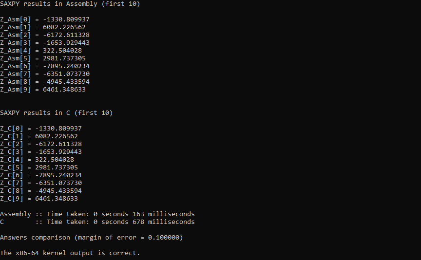

# saxpy-c-asm

Performance comparison of the SAXPY function in C and Assembly created for LBYARCH course.

## Installation

1. Clone the repository.
2. Open the project in Visual Studio 2022. Sample solution files (`.sln` and `.vcxproj`) for the settings needed to build the project are provided. Ensure they are placed in the root directory, as Visual Studio 2022 expects the files to be found there. If the project directory does not load directly with the correct structure, clicking the `saxpy-c-asm.sln` file would be an additional step to arrange the structure according to source files, resource files, header files, and external dependencies.

    The configurations needed to build successfully are as follows. The settings for `saxpy.asm` are for linking it properly with the main C program. The command used for the custom build tool assumes that [NASM](https://nasm.us/) is installed and added to [PATH](https://en.wikipedia.org/wiki/PATH_(variable)), but an absolute file path to the NASM assembler can be used as well. For instance, if your `nasm` file is located inside the nasm folder of your C drive, then your Custom Build Tool Command Line should be set to `c:\nasm\nasm -fwin64 saxpy.asm`. Adding `legacy_stdio_definitions.lib` as an additional dependency for the linker can help avoid linking issues as the Assembly code calls the C function `printf`.

    | File/Project          | Property                    | Field                   | Value                                                    |
    | --------------------- | --------------------------- | ----------------------- | -------------------------------------------------------- |
    | `saxpy.asm`           | General                     | Excluded From Build     | No                                                       |
    |                       |                             | Item Type               | Custom Build Tool                                        |
    |                       | Custom Build Tool > General | Command Line            | `nasm -f win64 saxpy.asm`                                |
    |                       |                             | Outputs                 | `saxpy.obj`                                              |
    | saxpy-c-asm (Project) | Linker > Input              | Additional Dependencies | `legacy_stdio_definitions.lib;%(AdditionalDependencies)` |

3. Build the solution and run it.

## Performance Analysis

The following table shows the average execution times in milliseconds/ms (rounded up to 5 decimal places) of the C and Assembly kernels over 30 runs each in debug and release mode for the different vector length `n` values: $2^{20}$, $2^{24}$, and $2^{28}$.

| Vector length (n)  | $2^{20}$ | $2^{24}$ | $2^{28}$  |
| ------------------ | -------- | -------- | --------- |
| C (Debug)          | 2.96667  | 41.43333 | 675.53333 |
| C (Release)        | 0.9      | 13.66667 | 212.9     |
| Assembly (Debug)   | 0.9      | 10.53333 | 176.13333 |
| Assembly (Release) | 1.1      | 15.3     | 246.73333 |

The table shows the C kernel's execution time in release mode of 0.9 ms is slightly faster than 2.96667 ms in debug mode, with a small difference of 2.06667 ms. between the C kernel's execution time in debug and release mode for $n = 2^{20}$. Having an average time of 13.66667 ms in release mode compared to 41.43333 ms in debug mode for $n = 2^{24}$, the difference grows into a significant 27.76666 ms difference. With a 212.9 ms average time in release mode against the 675.53333 ms time in debug mode for $n = 2^{28}$, there is a massive time difference of 462.63333 ms. This clearly shows that the compiler optimizations used for release mode can significantly improve performance times for C.

The table also illustrates that the execution time of the Assembly kernel in release mode is marginally slower at 1.1 ms compared to 0.9 ms in debug mode, a slight disparity of 0.2 ms for $n = 2^{20}$. As for $n = 2^{24}$, the average time varies with 15.3 ms in release mode versus 10.53333 ms in debug mode, showing a noticeable difference of 4.76667 ms. Similarly, for $n = 2^{28}$, the average time stands at 246.73333 ms in release mode, contrasting sharply with the 176.13333 ms in debug mode, resulting in a big time gap of 70.6 ms. It appears that the compiler optimizations used for release mode can counterintuitively and counterproductively slow down a linked Assembly function call.

Moreover, the table indicates that in debug mode for $n = 2^{20}$, the C kernel's execution time of 2.96667 ms is slower than the Assembly kernel's time which clocks in at 0.9 ms, a modest discrepancy of 2.06667 ms. As the input size increases to $n = 2^{24}$, the C kernel's time of 41.43333 ms becomes even slower compared to the Assembly kernel's time of 10.53333 ms, with a much more pronounced gap of 30.9 ms. For $n = 2^{28}$, the C kernel's execution time of 675.53333 ms in contrast with the Assembly kernel's execution time of 176.13333 ms creates a substantial time difference of 499.4 ms. This shows that in debug mode, Assembly code can be significantly faster compared to C code.

However, the table further reveals that in release mode, for $n = 2^{20}$, the C kernel's execution time of 0.9 ms is slightly faster than the Assembly kernel's time of 1.1 ms, resulting in a small discrepancy of 0.2 ms. As the input size escalates to $n = 2^{24}$, the C kernel's time of 13.66667 ms is faster to an extent in comparison to the Assembly kernel's time of 15.3 ms, a minor time difference of 1.63333 ms. At $n = 2^{28}$, the C kernel's execution time of 212.9 ms contrasted with the Assembly kernel's execution time of 246.73333 ms shows a moderate time difference of 33.83333 ms. It highlights that compiler optimizations in release mode can unexpectedly slow down linked Assembly code to the point that C code is noticeably faster by comparison.

## Screenshots

Program output in debug mode for $n = 2^{28}$.

Program output in release mode for $n = 2^{28}$.

