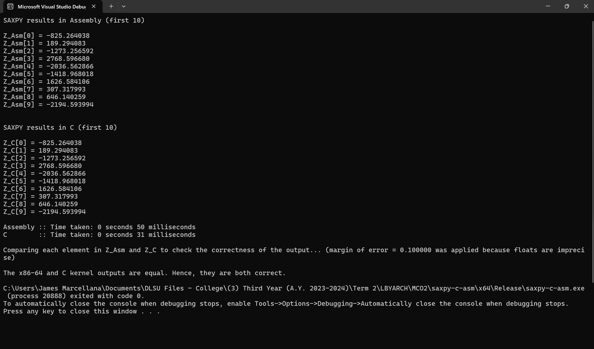

# saxpy-c-asm

Performance comparison of the SAXPY function in C and Assembly created for LBYARCH course.

## Installation

1. Clone the repository.
2. Open the solution file (`.sln`) in Visual Studio 2022. Sample project files (`.vcxproj`) containing the settings needed to build the project are provided. Ensure they are placed in the root directory, as Visual Studio 2022 expects the files to be found there. The complete list of these configurations can be found in the table below.
    - The settings for `saxpy.asm` are for linking it properly with the main C program.
    - The command used for the custom build tool assumes that [NASM](https://nasm.us/) is installed and added to [PATH](https://en.wikipedia.org/wiki/PATH_(variable)), but an absolute file path to the NASM assembler can be used as well (i.e. `path/to/nasm.exe` instead of `nasm`).
    - Adding `legacy_stdio_definitions.lib` as an additional dependency for the linker can help avoid linking issues as the Assembly code calls the C function `printf`.

    | File/Project          | Property                    | Field                   | Value                                                    |
    | --------------------- | --------------------------- | ----------------------- | -------------------------------------------------------- |
    | `saxpy.asm`           | General                     | Excluded From Build     | No                                                       |
    |                       |                             | Item Type               | Custom Build Tool                                        |
    |                       | Custom Build Tool > General | Command Line            | `nasm -f win64 saxpy.asm`                                |
    |                       |                             | Outputs                 | `saxpy.obj`                                              |
    | saxpy-c-asm (Project) | Linker > Input              | Additional Dependencies | `legacy_stdio_definitions.lib;%(AdditionalDependencies)` |

3. Set the desired configuration in building the project (i.e., either Debug or Release mode).
4. Build the solution and run it.

## Performance Analysis

The following table shows the average execution times in milliseconds (rounded up to 5 decimal places) of the C and Assembly kernels over 30 runs each in debug and release mode for the different vector length $n$ values: $2^{20}$, $2^{24}$, and $2^{30}$. The complete list of execution times of all runs per value of $n$ in both debug and release modes can be found in the [execution times sheets](https://github.com/ChorusMortis/saxpy-c-asm/blob/main/docs/sheets_execution-times-per-value-of-n.pdf) located in the docs folder of this repository.

| Vector length (n)  | $2^{20}$ | $2^{24}$ | $2^{30}$    |
| ------------------ | -------- | -------- | ----------- |
| C (Debug)          | 3.66667  | 44.93333 | 59999.73333 |
| C (Release)        | 2.13333  | 30.9     | 53279.73333 |
| Assembly (Debug)   | 3.8      | 47.83333 | 5253.7      |
| Assembly (Release) | 3.46667  | 55.56667 | 3014.53333  |

In terms of the results of the execution times using the C kernel, the table above shows that in the smallest value of $n = 2^{20}$, C had a slightly faster average execution time of $2.13333$ ms in release mode than the average execution time of $3.66667$ ms in debug mode. The two values slightly differ by $1.53333$ ms. When we attempted to increase the value of $n$ to $2^{24}$, the mean execution time in release mode increased to $30.9$ ms, while the mean execution time in debug mode rose to a higher value of $44.93333$ ms. Evidently, the difference between the two modes for the C kernel grew into a significant $14.03333$ ms, highlighting the effect of the growth of the number of elements for each vector. Meanwhile, in the largest value of $n = 2^{30}$, the average execution times grew exponentially at $59999.73333$ ms for the debug mode and $53279.73333$ ms for the release mode, which converts into an almost one-minute average running time for each mode. The gap between the two modes also increased massively at $6720$ ms, which converts into more than six seconds. As evident in the faster mean execution times for all three values of $n$ in release mode, it is clear that the compiler optimizations provided by the release mode can significantly improve the performance of the C kernel as compared to the debug mode.

On the other hand, the results of the execution times of the Assembly kernel show a slightly different behavior than the C kernel. For $n = 2^{20}$, the average execution time in release mode was marginally faster at $3.46667$ ms compared to the $3.8$ ms in debug mode. Comparatively, the two values slightly differ by $0.33333$ ms. Meanwhile, for $n = 2^{24}$, the release mode seems to have worsened the average execution time of the Assembly kernel at $55.56667$ ms compared to the slightly faster $47.83333$ ms of the debug mode, with a difference of $7.73334$ ms. This behavior could be potentially caused by the optimizations of the release mode that prove ineffective for the Assembly kernel on smaller values of $n$. In general, the release mode should have applied optimizations in the execution of the kernels, which in theory, can expedite the execution times. However, the settings applied may have affected the Assembly kernel differently for smaller values of $n$ since its real effect was more evident in the higher value of $n = 2^{30}$. In the table, the Assembly kernel had an average execution time of $3014.53333$ ms in release mode, which is significantly faster than the $5253.7$ ms execution time in debug mode.

Moving on to the comparison between the C and Assembly kernels, in theory, the execution time in Assembly should be faster or at least equal to that of C because the Assembly language has direct access to the CPU's instruction set, while C is a higher-level programming language. In the table above, results show that C had almost equal average execution times with the Assembly language in the lower values of $n = 2^{20}$ and $n = 2^{24}$. In debug mode, C had $3.66667$ ms and $44.93333$ ms mean execution times for $n = 2^{20}$ and $n = 2^{24}$, respectively, which aren't far away from Assembly's $3.8$ ms and $47.83333$ ms execution times for $n = 2^{20}$ and $n = 2^{24}$, respectively. The slight difference in these values, with C seemingly appearing as faster, may be attributed to various reasons, such as the small values of $n$, the hardware specifications used, or the modern compiler options of the debug mode that proved more efficient for C in smaller $n$ values. Meanwhile, in release mode, C had inevitably faster mean execution times than the Assembly kernel because of the compiler optimization applied that proved more efficient for C kernels than the Assembly kernels in the two lower values of $n$.

On the other hand, for the large $n$ value of $2^{30}$, the difference in the speed of execution between the Assembly and C kernels became more apparent, highlighting the efficiency of writing code in Assembly language. In debug mode, C had massive $59999.73333$ ms and $53279.73333$ average execution times for the debug and release mode, respectively, which are ridiculously high, making the data collection process for the 30 runs inevitably long. Meanwhile, the Assembly kernel only took $5253.7$ ms and $3014.53333$ ms for the debug and release mode, respectively, which are at least 10 times smaller than the mean execution times of the C kernel. Calculating their differences, the Assembly language saved $54746.03333$ ms for the debug mode and $50265.2$ ms for the release mode as compared to C, which are both above 50 seconds.

Overall, the higher values of $n$ that involve more operations to be done prove that the Assembly language is more efficient than C, given the faster mean execution times of the Assembly kernel that exhibit a massive gap from C's slower mean execution times. In this age where high-level programming languages are more prevalent and where many programmers doubt the use of the Assembly language, Assembly has proved that its capability to improve time complexity is unparalleled, surpassing C's capability, even with the release mode containing compiler optimizations that proved really efficient for C. Furthermore, this project has proved that the release mode can indeed expedite the average execution times of the kernels, given its nature of providing optimizations, as compared to the debug mode, which generally produces slower execution times.

## Screenshots

**Note:** Since the values for the scalar `A` and each element of the vectors `X` and `Y` are completely randomized in the program, then the checking for the correctness of output should be done at the same time for both C and x86-64 by comparing the value of each element in `Z_C` and `Z_Asm`. Furthermore, a margin of error of 0.10000 was put in place because floats are imprecise in the programming languages. If each element in `Z_C` is equal to each element in `Z_Asm`, then both of them produced correct answers in the program.

The screenshots for the program output on both C and x86-64 for each mode are as follows:

Program output with correctness check for both C and x86-64 (at the same time) in debug mode for $n = 2^{24}$.

Program output with correctness check for both C and x86-64 (at the same time) in release mode for $n = 2^{24}$.

